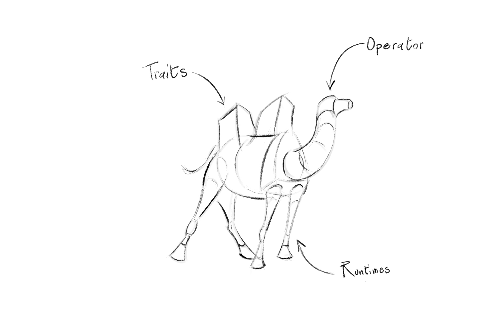

= Camel K Anatomy
:hp-tags: camel, camel-k, cloud
:published_at: 2019-01-06

A few months ago a new species of camel which has the ability to survive to the extreme environmental conditions of modern cloud systems has been discovered and named *Camel K*.

== Introduction

From a 10000 foot view, we can describe *Camel K* as a cloud native integration platform based on https://camel.apache.org/[Apache Camel] that leverage the power of the https://github.com/operator-framework/operator-sdk[Operator SDK] to run natively on https://kubernetes.io[Kubernetes] or https://www.openshift.com[OpenShift].

This is an introductory post of a series of mini-post in which I'm going to dissect *Camel K* to explain its internal structure, for a better overview and information about what to expect next, I'd recommend the following posts by the awesome https://www.nicolaferraro.me[Nicola Ferraro]:

* https://www.nicolaferraro.me/2018/10/15/introducing-camel-k/[Introducing Camel K]
* https://www.nicolaferraro.me/2018/12/10/camel-k-on-knative/[Camel K on Knative]

== Structure Overview

--

--

*Camel K" has three main component:

* *Operator*
+
An operators is "traditionally" defined as a method of packaging, deploying and managing a Kubernetes application but in Camel K we have moved this pattern to the next level and the *Camel K Operator* is the intelligence that coordinates all the moving parts
+
- it adapts the behavior of the platform according to the environment in which it runs
- it understands the integration code and configure the related Kubernetes resources according
- it adapts the integrations it runs according to the environment and the integration code

* *Traits*
+
They are what

* *Runtimes*
+
TBD
