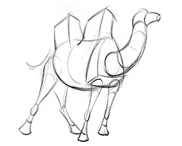

= Camel K Anatomy
:hp-tags: camel, camel-k, cloud
:published_at: 2019-01-06

A few months ago a new species of camel which has the ability to survive to the extreme environmental conditions of modern cloud systems, has been discovered and named *Camel K*.

=== About

This is an introduction of the main characteristics of this new creature which I'm going to dissect to study its anatomical structure in a series of upcoming blog posts.

[NOTE]
====
For an higher level overview about Camel K I'd recommend the following posts by the awesome https://www.nicolaferraro.me[Nicola Ferraro]:

* https://www.nicolaferraro.me/2018/10/15/introducing-camel-k/[Introducing Camel K]
* https://www.nicolaferraro.me/2018/12/10/camel-k-on-knative/[Camel K on Knative]
====

=== What are the main characteristics of this creature ?

* Intelligent Operator
* Trait
* Runtime

--

--
