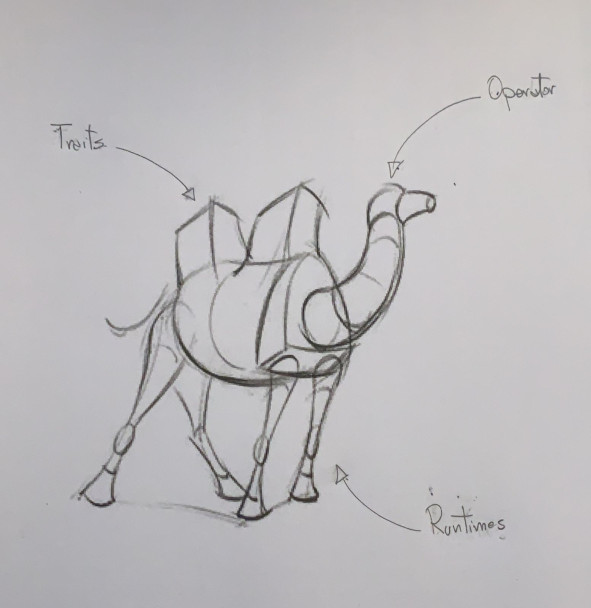

= Camel K Anatomy
:hp-tags: camel, camel-k, cloud
:published_at: 2019-01-06

A few months ago a new species of camel which has the ability to survive to the extreme environmental conditions of modern cloud systems has been discovered and named *Camel K*.

=== About

This post is an introduction to the main characteristics of this new creature which I'm going to dissect to study its anatomical structure in a series of upcoming blog posts.

For a quick description of what *Camel K* is, we can describe it as a platform written in https://golang.org/[Go] that leverage the power of the https://github.com/operator-framework/operator-sdk[Operator SDK] to run cloud native integration based on https://camel.apache.org/[Apache Camel] but for a better overview I'd recommend the following posts by the awesome https://www.nicolaferraro.me[Nicola Ferraro]:

* https://www.nicolaferraro.me/2018/10/15/introducing-camel-k/[Introducing Camel K]
* https://www.nicolaferraro.me/2018/12/10/camel-k-on-knative/[Camel K on Knative]

=== Camel K main characteristics

--

--

* *Operator*
+
It coordinates all the moving parts that make it possible to create true cloud native integrations.

* *Traits*
+
TBD

* *Runtimes*
+
TBD
